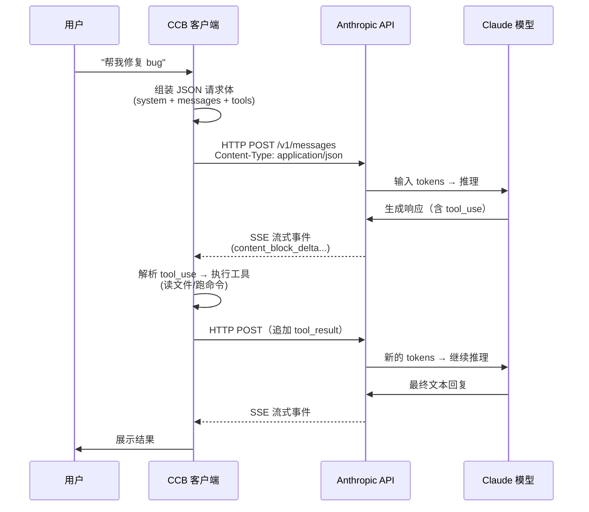
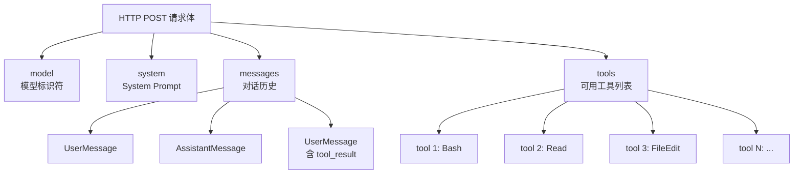
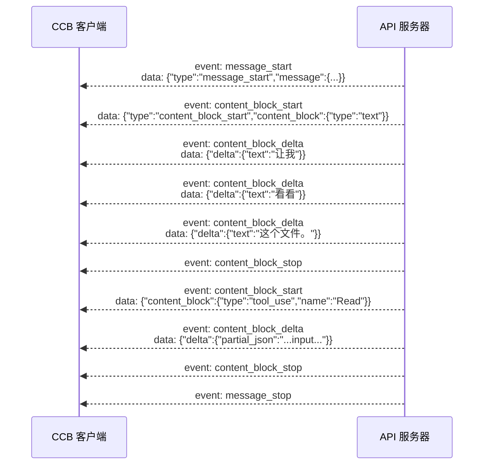
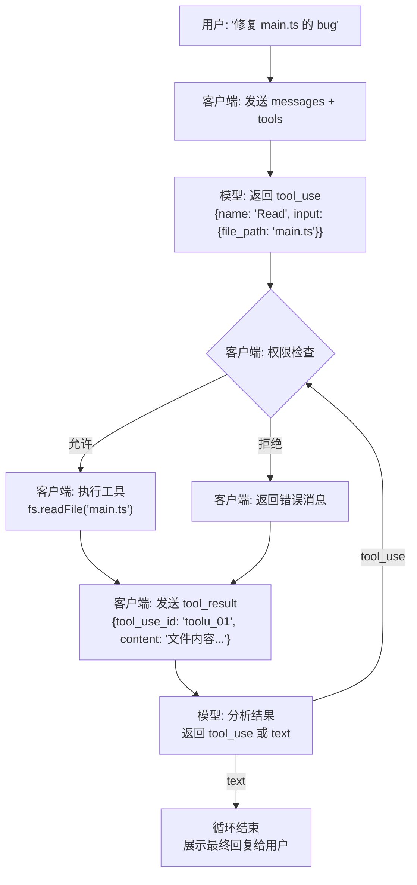
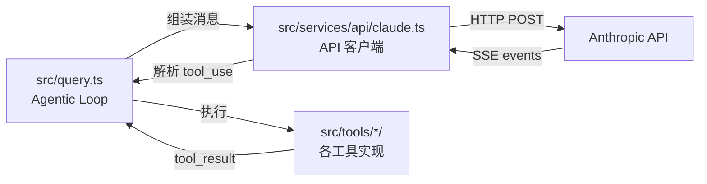

{/* 本章目标：让读者理解 AI 客户端与后端模型之间的通信协议全貌 */}

## 核心问题

当 AI 在终端里"读代码、改文件、跑命令"时，这些操作是怎么发生的？

答案是：**AI 模型不能直接执行任何操作**。它只能通过一套约定好的 JSON 协议，"请求"客户端代为执行。整个通信过程是**纯文本 JSON + HTTP** 传输，没有二进制协议、没有 RPC。

## 通信架构总览



## 协议层次

| 层次 | 技术 | 说明 |
|------|------|------|
| **传输层** | HTTPS | TLS 加密的 HTTP/1.1 或 HTTP/2 |
| **通信模式** | SSE (Server-Sent Events) | 服务器单向推送流式响应 |
| **数据格式** | JSON | 纯文本结构化数据 |
| **API 规范** | Anthropic Messages API | 定义消息、工具、内容块的 JSON Schema |

全程**没有**：WebSocket（API 层）、gRPC、Protocol Buffers、二进制序列化。

## 请求格式：客户端 → API

每次 API 调用的请求体是一个 JSON 对象，包含 4 个核心部分：



### 完整请求示例

```json
{
  "model": "claude-sonnet-4-6",
  "max_tokens": 16384,
  "stream": true,
  "system": [
    {
      "type": "text",
      "text": "你是 Claude，一个 AI 编程助手...\n当前项目：/Users/hard/code/...\n日期：2026-04-03"
    }
  ],
  "tools": [
    {
      "name": "Bash",
      "description": "在终端执行 shell 命令",
      "input_schema": {
        "type": "object",
        "properties": {
          "command": {
            "type": "string",
            "description": "要执行的 bash 命令"
          },
          "timeout": {
            "type": "number",
            "description": "超时时间（毫秒）"
          }
        },
        "required": ["command"]
      }
    },
    {
      "name": "Read",
      "description": "读取文件内容",
      "input_schema": {
        "type": "object",
        "properties": {
          "file_path": {
            "type": "string",
            "description": "文件的绝对路径"
          },
          "offset": { "type": "number" },
          "limit": { "type": "number" }
        },
        "required": ["file_path"]
      }
    }
  ],
  "messages": [
    {
      "role": "user",
      "content": "帮我找到并修复 main.ts 里的类型错误"
    }
  ]
}
```

### 工具定义的核心要素

每个工具通过 **JSON Schema** 告诉模型"你可以怎么调用我"：

| 字段 | 作用 | 示例 |
|------|------|------|
| `name` | 工具的唯一标识符 | `"Bash"`, `"Read"`, `"FileEdit"` |
| `description` | 告诉模型这个工具做什么 | `"在终端执行 shell 命令"` |
| `input_schema` | 定义输入参数的 JSON Schema | `{ "properties": { "command": {...} } }` |

模型在训练时已经学会了如何理解 JSON Schema，并生成符合 schema 的参数。

## 响应格式：API → 客户端

### 流式 SSE 事件

API 不是一次性返回完整响应，而是通过 SSE 逐步推送事件：



这就是为什么你在终端里能看到 AI "逐字打出"回答——每个 `content_block_delta` 事件只包含几个新字符。

### 两种响应内容类型

模型的响应只有两种内容类型：

#### 类型 1：纯文本（`text`）—— 表示最终回复

```json
{
  "type": "text",
  "text": "已修复了 3 个文件中的 5 处类型错误。"
}
```

#### 类型 2：工具调用（`tool_use`）—— 表示要执行操作

```json
{
  "type": "tool_use",
  "id": "toolu_01XkF9qP2Gmr",
  "name": "Read",
  "input": {
    "file_path": "src/main.ts"
  }
}
```

**关键理解**：模型**只能输出 JSON 文本**。它不能直接读文件、不能直接跑命令。`tool_use` 只是一个"请求"，真正的执行由客户端完成。

## 工具调用协议：完整的交互循环



### tool_use 和 tool_result 的配对机制

每次工具调用通过**唯一 ID** 配对请求和结果：

```json
// ① 模型发出的工具调用请求
{
  "role": "assistant",
  "content": [
    {
      "type": "tool_use",
      "id": "toolu_01XkF9qP2Gmr",    // ← 唯一 ID
      "name": "Bash",
      "input": { "command": "ls -la src/" }
    }
  ]
}

// ② 客户端执行后返回的结果
{
  "role": "user",
  "content": [
    {
      "type": "tool_result",
      "tool_use_id": "toolu_01XkF9qP2Gmr",  // ← 必须引用相同的 ID
      "content": "total 64\ndrwxr-xr-x  12 user  staff  384  Apr  3 main.tsx\n..."
    }
  ]
}
```

**注意**：`tool_result` 的角色是 `user`，因为 API 要求消息严格按 user → assistant → user 交替。工具结果在协议层被视为"用户提供的信息"。

### 一次完整的多轮工具调用示例

以下展示"修复 bug"场景的完整 JSON 消息序列：

```json
[
  // 第 1 轮：用户提问
  {
    "role": "user",
    "content": "帮我修复 main.ts 里的 bug"
  },

  // 第 2 轮：模型请求读文件
  {
    "role": "assistant",
    "content": [
      { "type": "text", "text": "让我先看看文件内容。" },
      {
        "type": "tool_use",
        "id": "toolu_001",
        "name": "Read",
        "input": { "file_path": "src/main.ts" }
      }
    ]
  },

  // 第 3 轮：客户端返回文件内容
  {
    "role": "user",
    "content": [
      {
        "type": "tool_result",
        "tool_use_id": "toolu_001",
        "content": "const x: string = 123\nconsole.log(x)"
      }
    ]
  },

  // 第 4 轮：模型请求修改文件
  {
    "role": "assistant",
    "content": [
      { "type": "text", "text": "找到了第 1 行的类型错误。" },
      {
        "type": "tool_use",
        "id": "toolu_002",
        "name": "FileEdit",
        "input": {
          "file_path": "src/main.ts",
          "old_string": "const x: string = 123",
          "new_string": "const x: number = 123"
        }
      }
    ]
  },

  // 第 5 轮：客户端返回修改结果
  {
    "role": "user",
    "content": [
      {
        "type": "tool_result",
        "tool_use_id": "toolu_002",
        "content": "✅ 文件已修改"
      }
    ]
  },

  // 第 6 轮：模型请求验证修复
  {
    "role": "assistant",
    "content": [
      { "type": "text", "text": "让我验证一下修复是否有效。" },
      {
        "type": "tool_use",
        "id": "toolu_003",
        "name": "Bash",
        "input": { "command": "bun run dev 2>&1 | head -5" }
      }
    ]
  },

  // 第 7 轮：客户端返回命令输出
  {
    "role": "user",
    "content": [
      {
        "type": "tool_result",
        "tool_use_id": "toolu_003",
        "content": "✓ No errors found\nServer running on port 3000"
      }
    ]
  },

  // 第 8 轮：模型给出最终回复（纯文本，无 tool_use → 循环结束）
  {
    "role": "assistant",
    "content": [
      {
        "type": "text",
        "text": "已修复！将第 1 行的 `string` 改为 `number`。编译验证通过。"
      }
    ]
  }
]
```

## 图片传输

图片以 **base64 编码**嵌入 JSON 中传输。详细的传输机制和压缩策略参见 [MCP 图片传输机制](../extensibility/mcp-protocol.mdx#mcp-图片传输机制)。

```json
{
  "type": "image",
  "source": {
    "type": "base64",
    "media_type": "image/png",
    "data": "/9j/4AAQSkZJRgABAQ..."
  }
}
```

服务器收到后会自动解码，通过视觉编码器（Vision Encoder）转换为视觉 tokens，与文本 tokens 混合输入模型。客户端只负责编码和大小控制。

## 源码中的实现位置



| 源码文件 | 职责 |
|---------|------|
| `src/services/api/claude.ts` | 构建请求参数、发起流式请求、解析 SSE 事件 |
| `src/query.ts` | Agentic Loop 主循环：发请求 → 收响应 → 执行工具 → 循环 |
| `src/Tool.ts` | Tool 接口定义（`name`, `inputSchema`, `call()`) |
| `src/tools/*/` | 各工具的具体实现（BashTool, FileReadTool, FileEditTool 等） |
| `src/types/message.ts` | 消息类型定义（UserMessage, AssistantMessage 等） |

## 关键设计原则

### 1. 模型不能直接执行任何操作

模型只能输出结构化 JSON 文本。所有实际操作（读文件、写文件、运行命令）都由客户端代为执行。这是一个**安全边界**——模型的"意图"必须经过客户端的权限检查才能变成"行动"。

### 2. 工具定义用 JSON Schema

每个工具通过 JSON Schema 描述输入格式。模型在训练中已学会理解 schema 并生成合法参数。这意味着**新增一个工具只需要定义 schema**，不需要重新训练模型。

### 3. 上下文即记忆

模型本身没有持久记忆。它"记住"之前操作的方式是：**所有历史消息（包括 tool_use 和 tool_result）都作为上下文重新发送**。这就是为什么对话越长，token 消耗越多，最终需要 compaction（压缩）。

### 4. 流式传输实现"打字机效果"

API 使用 SSE 逐 token 推送响应。CCB 的 `StreamingToolExecutor` 更进一步——在流式接收过程中就开始并行执行工具，不等流结束，大幅减少等待时间。

### 5. 所有通信可审计

因为全部是纯文本 JSON，每次 API 调用都可以完整记录和回放（`recordTranscript()`）。这使得 `--resume` 功能（恢复会话）和调试分析成为可能。
